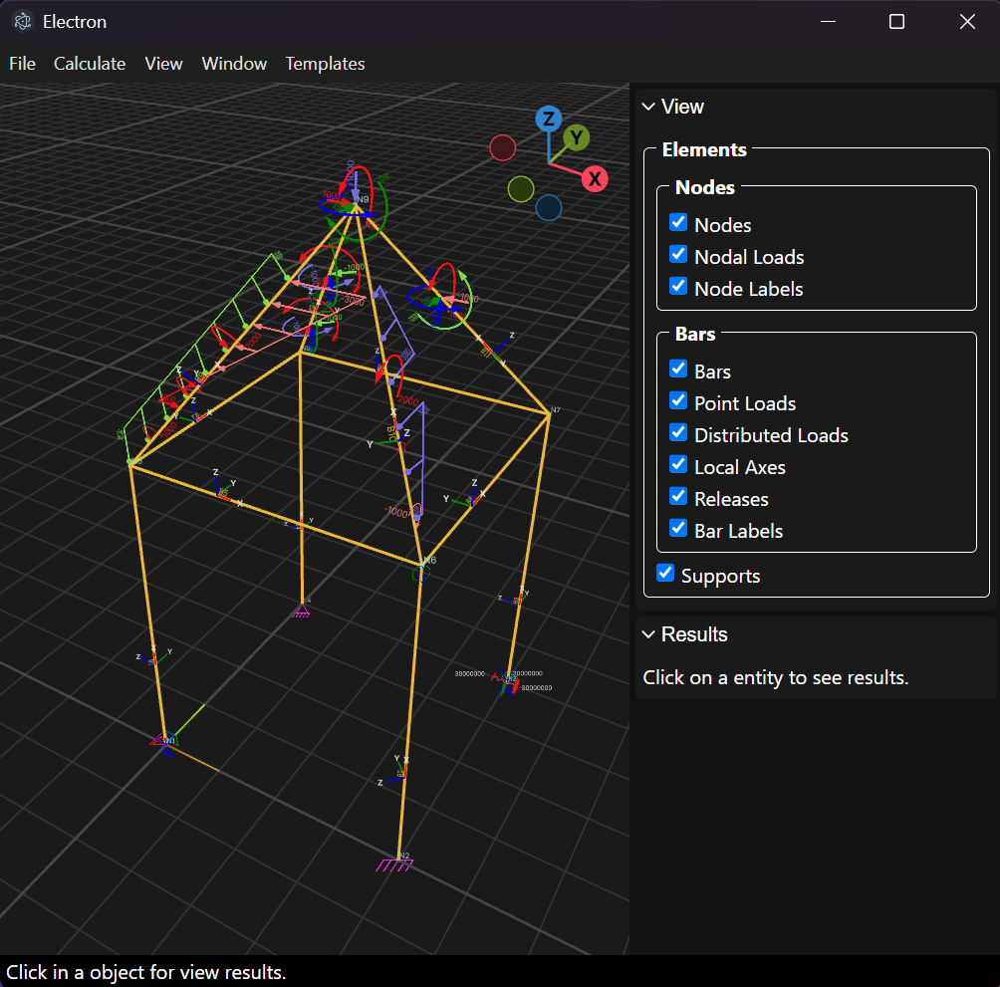
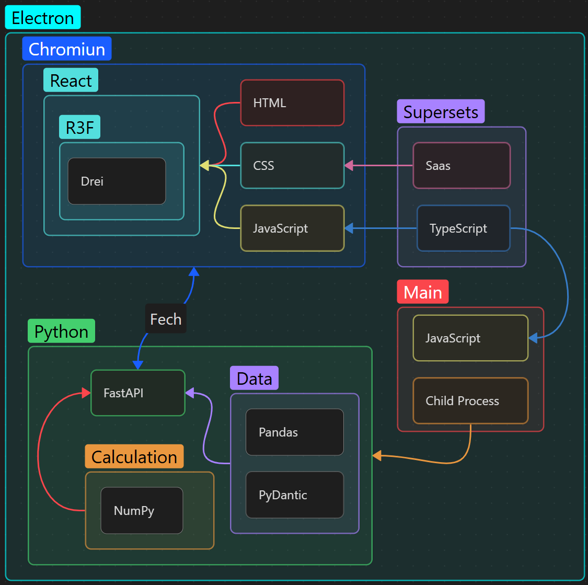

# PyEngineerView


A modern desktop application for structural engineering analysis and visualization

## 📋 Overview

PyEngineerView is a powerful desktop application that combines a modern Electron/React interface
with a Python-based structural analysis engine. It provides engineers with an intuitive 3D
environment to model, analyze, and visualize structural systems including frames, trusses, and beam
structures.

### Screenshot



### Key Features

- 🏗️ **Structural Analysis Engine**: Linear structural analysis with support for 3D frames and
trusses
- 📊 **Excel Integration**: Import structural models directly from Excel templates
- 🎨 **3D Visualization**: Interactive 3D scene powered by Three.js and React Three Fiber
- 🔄 **Real-time Results**: Calculate and visualize internal forces, displacements, and reactions
- 💾 **JSON Format**: Save and share calculated structures in lightweight JSON format
- 🖱️ **Intuitive Interface**: Click on elements to inspect detailed analysis results
- 🎯 **Color-coded Elements**: Visual distinction for different axes, loads, and structural
components

## 🏛️ Architecture

PyEngineerView follows a hybrid architecture:

- **Frontend**: Electron + React + TypeScript + Three.js
  - Main process handles Python backend lifecycle and IPC
  - Renderer process provides the 3D visualization interface
  - Preload scripts expose safe APIs to renderer

- **Backend**: Python + FastAPI + NumPy
  - RESTful API for structural calculations
  - Matrix-based linear analysis engine
  - Excel and JSON file processing

### Communication Flow

```text
┌─────────────────────┐         ┌──────────────────────┐         ┌─────────────────────┐
│   React Frontend    │   IPC   │  Electron Main       │  HTTP   │  Python Backend     │
│   (UI/3D)           │ <-----> │  Process             │ <-----> │  (FastAPI)          │
│                     │         │                      │         │                     │
│  - Three.js         │         │  - Backend Lifecycle │         │  - NumPy Engine     │
│  - React Components │         │  - IPC Bridge        │         │  - Structural Calc  │
│  - User Interface   │         │  - File Operations   │         │  - Excel Processing │
└─────────────────────┘         └──────────────────────┘         └─────────────────────┘
```

### Architecture Diagram



## 🚀 Getting Started

### Prerequisites

- **Node.js** 18 or higher
- **npm** or **yarn**
- **Python** 3.11 or higher
- **pip** (Python package manager)

### Installation

1 - **Clone the repository**

```bash
git clone https://github.com/lidaltonlima/PyEngineerView.git
cd PyEngineerView
```

2 - **Install frontend dependencies**

```bash
npm install
```

3 - **Set up Python backend**

Navigate to the backend folder and install dependencies:

```bash
cd src/backend
pip install -r requirements.txt
```

> **Note**: It's recommended to use a Python virtual environment:
>
> ```bash
> python -m venv .venv
> .venv\Scripts\activate  # On Windows
> source .venv/bin/activate  # On macOS/Linux
> pip install -r requirements.txt
> ```

### Development

Run the application in development mode:

```bash
npm run dev
```

This will:

- Start the Electron app with hot reload
- Launch the Python backend automatically
- Enable React Fast Refresh

For testing the built version:

```bash
npm run start
```

### Building for Production

Build the application for your platform:

```bash
# Windows
npm run build:win

# macOS
npm run build:mac

# Linux
npm run build:linux
```

The built application will be in the `dist/` folder.

## 📖 User Guide

### Creating and Analyzing Structures

1. **Get the Excel Template**
    - Go to `Templates > Get Excel Template`
    - Use this template to define your structural model

2. **Import Your Model**
    - Use `File > Open File` to import the Excel file
    - You can also open previously saved `.json` files

3. **Calculate the Structure**
    - Go to `Calculate > Calculate Structure`
    - The engine will perform linear analysis
    > [!IMPORTANT]
    > Currently the calculation supports only:
    > - Linear elastic analysis
    > - Symmetric cross-sections
    > - Loads applied at the Center of Gravity (CG) which must coincide with the Shear Center (SC)

4. **View Results**
    - Click on any structural element (node, bar, support)
    - Results appear in the right panel under the `Results` tab

### Navigation Controls

**Zooming:**

- Scroll mouse wheel to zoom in/out
- Hold **Ctrl** to increase zoom speed
- Hold **Shift** to decrease zoom speed

**Rotation:**

- Middle-mouse button + drag to rotate scene
- Hold **Ctrl** for camera-based dragging
- Hold **Shift** for grid-based dragging

### Visualization Panel

In the right panel's `View` tab, you can:

- Toggle visibility of different element types
- Show/hide nodes, bars, supports, and loads
- Improve visualization for complex structures

### Color Scheme

The application uses a consistent color-coding system:

| Color | Meaning |
|-------|---------|
| 🔴 Red | X-axis elements, supports, and loads |
| 🟢 Green | Y-axis elements, supports, and loads |
| 🔵 Blue | Z-axis elements, supports, and loads |
| 🟦 Cyan | Nodes |
| 🟠 Orange | Bars |
| Magenta | Basic Supports |

OBS: _Lighter shades represent negative loads_

### Saving Your Work

- `File > Save`: Save to current file
- `File > Save As`: Save to a new location
- Structures are saved in JSON format including all calculation results

## 🏗️ Project Structure

```brash
PyEngineerView/
├── src/
│   ├── main/                # Electron main process
│   │   ├── index.ts         # Entry point, backend lifecycle
│   │   ├── menuBar.ts       # Application menu
│   │   └── utils/           # File operations utilities
│   │
│   ├── preload/             # Preload scripts (IPC bridge)
│   │   └── index.ts
│   │
│   ├── renderer/            # React frontend
│   │   └── src/
│   │       ├── App.tsx      # Main app component
│   │       ├── components/  # React components (3D objects, UI)
│   │       ├── contexts/    # React contexts (state management)
│   │       ├── types/       # TypeScript type definitions
│   │       └── utils/       # Frontend utilities
│   │
│   └── backend/             # Python backend
│       ├── main.py          # FastAPI server entry point
│       ├── requirements.txt # Python dependencies
│       └── pyengineer/      # Structural analysis library
│           ├── analysis/    # Analysis algorithms (linear solver)
│           ├── objects/     # Structural objects (Node, Bar, etc.)
│           ├── functions/   # Engineering functions
│           ├── tools/       # High-level calculation tools
│           └── types/       # Type definitions
│
├── build/                   # Build resources
├── docs/                    # Additional documentation
├── public/                  # Static assets
├── resources/               # Application resources
└── examples/                # Example structure files
```

## 🛠️ Technology Stack

### Frontend

- **Electron** 35+ - Desktop application framework
- **React** 19+ - UI library
- **TypeScript** 5.8+ - Type-safe JavaScript
- **Three.js** + **React Three Fiber** - 3D graphics
- **@react-three/drei** - 3D helpers and abstractions
- **Vite** - Build tool and dev server
- **SASS** - CSS preprocessing

### Backend

- **Python** 3.11+ - Core language
- **FastAPI** - Web framework for REST API
- **NumPy** - Numerical computing and matrix operations
- **Pandas** - Data manipulation (Excel processing)
- **OpenPyXL** - Excel file handling
- **Uvicorn** - ASGI server
- **PyInstaller** - Python to executable compilation

### Build & Development

- **Electron Vite** - Build tooling
- **Electron Builder** - Application packaging
- **ESLint** + **Prettier** - Code quality and formatting

## 🔌 API Reference

The Python backend exposes a RESTful API on a dynamically assigned port.

### Endpoints

#### `POST /open_excel`

Import a structural model from an Excel file.

**Request:**

```json
{
  "path": "C:/path/to/structure.xlsx"
}
```

**Response:** Structure data in JSON format

#### `POST /calculate_structure`

Perform linear structural analysis on provided structure data.

**Request:** Structure data (JSON)

**Response:** Structure data with calculation results

**Error Codes:**

- `422` - Unstable structure (check supports, releases, and loads)
- `500` - Internal server error

## 🧪 Development

### Recommended IDE Setup

- [VSCode](https://code.visualstudio.com/)
- [ESLint Extension](https://marketplace.visualstudio.com/items?itemName=dbaeumer.vscode-eslint)
- [Prettier Extension](https://marketplace.visualstudio.com/items?itemName=esbenp.prettier-vscode)
- [Python Extension](https://marketplace.visualstudio.com/items?itemName=ms-python.python)

### Available Scripts

```bash
# Development
npm run dev          # Start in development mode
npm run start        # Build and start

# Code Quality
npm run format       # Format code with Prettier
npm run lint         # Lint code with ESLint
npm run typecheck    # Check TypeScript types

# Building
npm run build        # Build for current platform
npm run build:win    # Build for Windows
npm run build:mac    # Build for macOS
npm run build:linux  # Build for Linux
```

### Python Backend Development

To rebuild the Python backend executable:

```bash
cd src/backend
pyinstaller --onefile --noconsole --name engineer main.py
```

The executable will be created in `src/backend/dist/engineer.exe` (Windows) or equivalent on other
platforms.

## 🤝 Contributing

We welcome contributions from the community! Here's how you can help:

### Ways to Contribute

- 🐛 **Report bugs** - Open an issue with details and reproduction steps
- 💡 **Suggest features** - Share your ideas for improvements
- 📝 **Improve documentation** - Help make the docs clearer
- 🔧 **Submit pull requests** - Fix bugs or implement features

### Development Workflow

1. **Fork the repository**

2. **Create a feature branch**

   ```bash
   git checkout -b feature/your-feature-name
   ```

3. **Make your changes**
   - Follow the existing code style
   - Add tests if applicable
   - Update documentation as needed

4. **Test your changes**

   ```bash
   npm run lint
   npm run typecheck
   npm run dev  # Test the application
   ```

5. **Commit your changes**

   ```bash
   git commit -m "feat: add your feature description"
   ```

   Follow [Conventional Commits](https://www.conventionalcommits.org/):
   - `feat:` - New features
   - `fix:` - Bug fixes
   - `docs:` - Documentation changes
   - `style:` - Code style changes (formatting)
   - `refactor:` - Code refactoring
   - `test:` - Adding or updating tests
   - `chore:` - Maintenance tasks

6. **Push to your fork**

   ```bash
   git push origin feature/your-feature-name
   ```

7. **Open a Pull Request**
   - Provide a clear description of the changes
   - Reference any related issues
   - Wait for review and address feedback

### Code Style Guidelines

**TypeScript/JavaScript:**

- Use TypeScript for type safety
- Follow ESLint rules
- Use functional components and hooks in React
- Keep components small and focused

**Python:**

- Follow PEP 8 style guide
- Use type hints where appropriate
- Write docstrings for classes and functions
- Keep functions focused and testable

### Setting Up Development Environment

1. Install all dependencies as described in [Installation](#installation)
2. Enable ESLint and Prettier in your IDE
3. Configure Python linting (pylint, flake8, or similar)
4. Test that both frontend and backend run correctly

### Testing

Before submitting a PR:

- Test the application in development mode
- Build and test the production version
- Verify both Excel import and JSON workflows
- Check that calculations produce correct results
- Test on your target platform (Windows/macOS/Linux)

### Getting Help

- 📧 Open an issue for questions
- 💬 Join discussions in existing issues
- 📖 Check the documentation in the `docs/` folder

## 📄 License

This project is licensed under the MIT License - see the [LICENSE](LICENSE) file for details.

```Text
MIT License

Copyright (c) 2025 Lidalton S. de Lima

Permission is hereby granted, free of charge, to any person obtaining a copy
of this software and associated documentation files (the "Software"), to deal
in the Software without restriction, including without limitation the rights
to use, copy, modify, merge, publish, distribute, sublicense, and/or sell
copies of the Software, and to permit persons to whom the Software is
furnished to do so, subject to the following conditions:

The above copyright notice and this permission notice shall be included in all
copies or substantial portions of the Software.
```

## 👨‍💻 Author

Lidalton S. de Lima

## 🙏 Acknowledgments

- Built with [Electron Vite](https://electron-vite.org/)
- 3D rendering powered by [Three.js](https://threejs.org/)
- Structural analysis using [NumPy](https://numpy.org/)
- UI framework by [React](https://react.dev/)

## 📮 Support

If you encounter any issues or have questions:

1. Check existing [Issues](https://github.com/lidaltonlima/PyEngineerView/issues)
2. Open a new issue with detailed information
3. Include screenshots or error messages if applicable

---

<!-- markdownlint-disable MD033 -->
<div align="center">

Made with ❤️ for the structural engineering community

⭐ Star this project if you find it helpful!

</div>
<!-- markdownlint-enable MD033 -->
